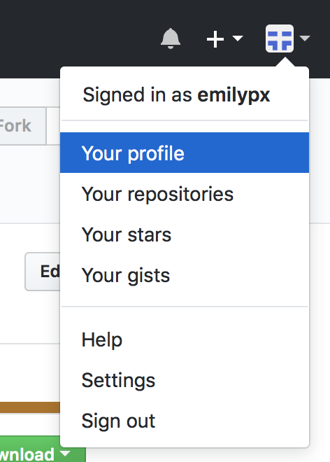

# Problem Set 0

## Parts 1 and 2: Due Wednesday, August 29, 3:00pm
## Part 3: Due Wednesday, August 30, 11:59pm

---

### Part 1: Create a GitHub account
1. If you do not have a GitHub account, create one [here](https://github.com/join?source=header-home).

2. Once you have a GitHub account, edit your profile so that the Name associated with your GitHub user ID *exactly matches* your name in Canvas. We must know the name associated with your GitHub ID so that we can enter your grades correctly in the Canvas gradebook. Go to GitHub, click on the funny geometric icon (or whatever photo you might already have uploaded) in the upper right corner, and select Settings.   In the Name field of your Public Profile, enter your name as it appears in Canvas. 

&nbsp;&nbsp;&nbsp;&nbsp;&nbsp;&nbsp;&nbsp;&nbsp;&nbsp; 

### Part 2: Course Survey

1. Take [this short survey](https://goo.gl/forms/gKiVUX25ZZH9XYnW2).

2. Take a screenshot of the page you see after you submit your survey response.

### Part 3: Submit to GitHub Classroom

After you take the survey, I will invite you to complete Problem Set 0 on GitHub Classroom. You'll receive an email notifying you of this invitation. Follow the instructions in the email. When you accept the invitation to complete Problem Set 0, GitHub classroom will create a repository for you. While in that repository, do the following:

1. Upload your screenshot to your repository.

2. Commit.

## Important Note
*For each future problem set, you will receive an email "inviting" you to accept the assignment. You will also be able to access the invitation as a link on Canvas under the Assignments area. When you know a problem set is going to be due soon (which you will know from paying attention in class and following the [course schedule](https://docs.google.com/spreadsheets/d/1l9SyJeukRpBjjyKE4N5IbpU2AcpS_MUX8ksVs5GH-rE/edit#gid=305794412)), look out for the email invitation. If you don't get or can't find the invitation, you can simply locate the link on Canvas.* 

---

[In case of changes to this assignment, updated files can be found here (https://github.com/BC-CSCI-1102-F18-MW/ps0)
